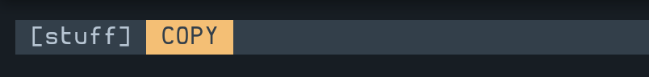
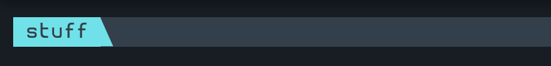

# Tmux Mode Indicator

This is a plugin that displays the currently active Tmux mode (i.e. empty, prefix, copy, or sync).

> **NOTE**
>
> This is just a cleaned-up/commented version of MunifTanjim's
> [tmux-mode-indicator](https://github.com/MunifTanjim/tmux-mode-indicator), which, itself, is a
> trimmed-down version of
> [tmux-prefix-highlight](https://github.com/tmux-plugins/tmux-prefix-highlight).

## Screenshots





## Install

### Installation with [Tmux Plugin Manager](https://github.com/tmux-plugins/tpm).

Add the following line to your `.tmux.conf`.

```tmux
set -g @plugin 'pwnalone/tmux-mode-indicator'
```

### Manual Installation

Clone the repo.

```sh
git clone https://github.com/pwnalone/tmux-mode-indicator ~/.tmux/plugins/tmux-mode-indicator
```

Add the following line to your `.tmux.conf`.

```tmux
run ~/.tmux/plugins/tmux-mode-indicator/mode_indicator.tmux
```

## Usage

Add `#{mode_indicator}` to your status line.

```tmux
set -g status-left ' [#S] #{mode_indicator}'
```

## Configure

```tmux
# Set the values of the indicator for the tmux (empty), wait (prefix), copy, and sync modes.
set -g @mode_indicator_tmux_value ' TMUX '
set -g @mode_indicator_wait_value ' WAIT '
set -g @mode_indicator_copy_value ' COPY '
set -g @mode_indicator_sync_value ' SYNC '

# Set the styles of the indicator for the tmux (empty), wait (prefix), copy, and sync modes.
set -g @mode_indicator_tmux_style 'fg=black,bg=green'
set -g @mode_indicator_wait_style 'fg=black,bg=cyan'
set -g @mode_indicator_copy_style 'fg=black,bg=yellow'
set -g @mode_indicator_sync_style 'fg=black,bg=red'
```

For example, I prefer to indicate the current mode via the background color of my session's name, so
my Tmux config contains the following lines.

```tmux
set -g status-left '#{mode_indicator}'

set -g @mode_indicator_tmux_value ' #S #[reverse]'
set -g @mode_indicator_wait_value ' #S #[reverse]'
set -g @mode_indicator_copy_value ' #S #[reverse]'
set -g @mode_indicator_sync_value ' #S #[reverse]'
```

This gives me something like this.





## Alternatives

- [tmux-plugins/tmux-prefix-highlight](https://github.com/tmux-plugins/tmux-prefix-highlight)
- [MunifTanjim/tmux-mode-indicator](https://github.com/MunifTanjim/tmux-mode-indicator)
